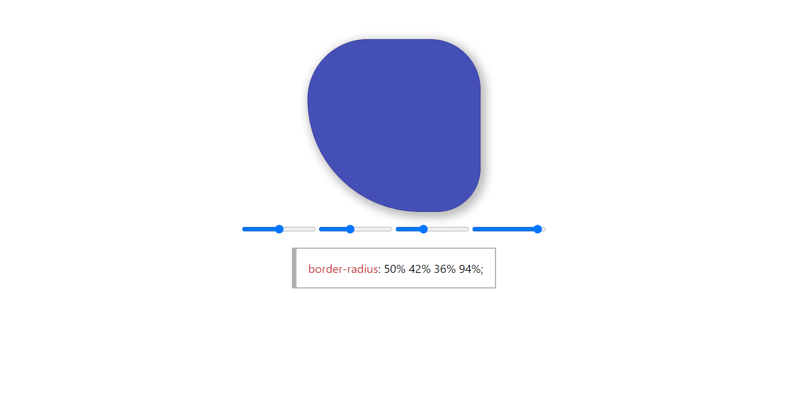

# Border Radius Generator 

> ✨ This is a simple app to generate border-radius for quick usage.
## Getting Started 

go to https://csb-i0o9h.mostafatourad.vercel.app/ and play with it 

## Demo 

## Available Scripts

### npm start

Runs the app in the development mode.
Open http://localhost:8080 to view it in the browser.

### npm test

Launches the test runner in the interactive watch mode.
See the section about running tests for more information.

### npm run build

Builds a static copy of your site to the `build/` folder.
Your app is ready to be deployed!

**For the best production performance:** Add a build bundler plugin like "@snowpack/plugin-webpack" or "@snowpack/plugin-parcel" to your `snowpack.config.json` config file.

